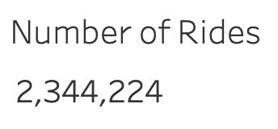
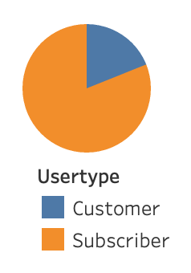
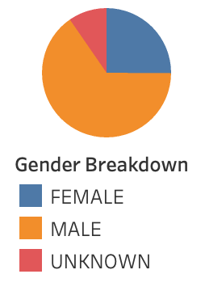
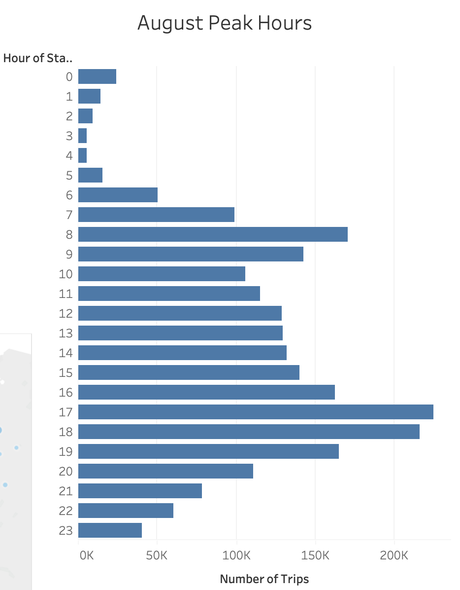
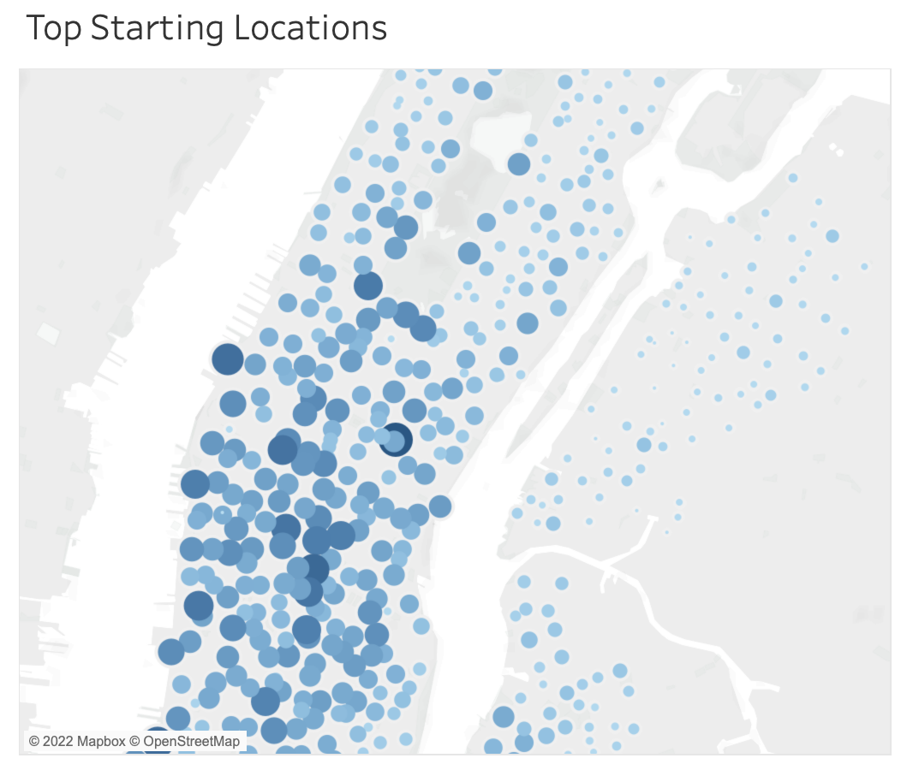
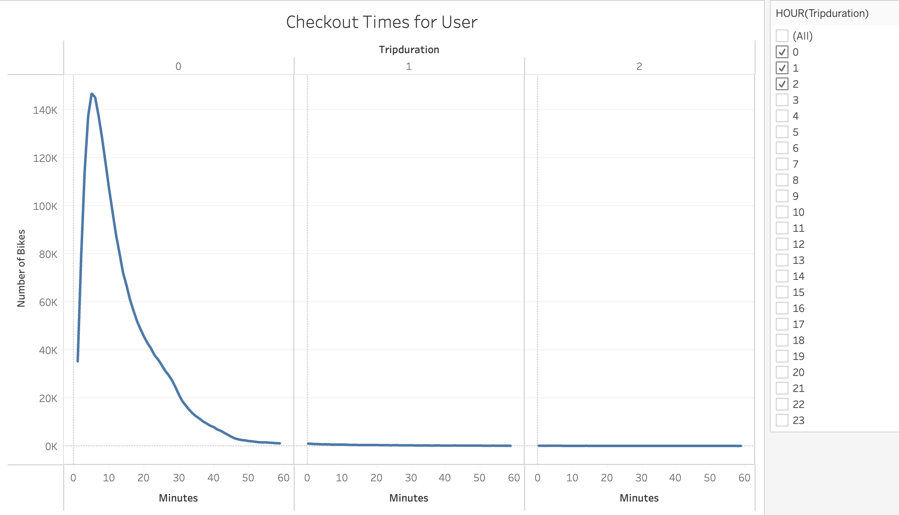
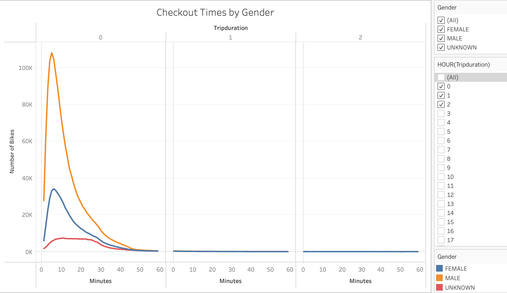
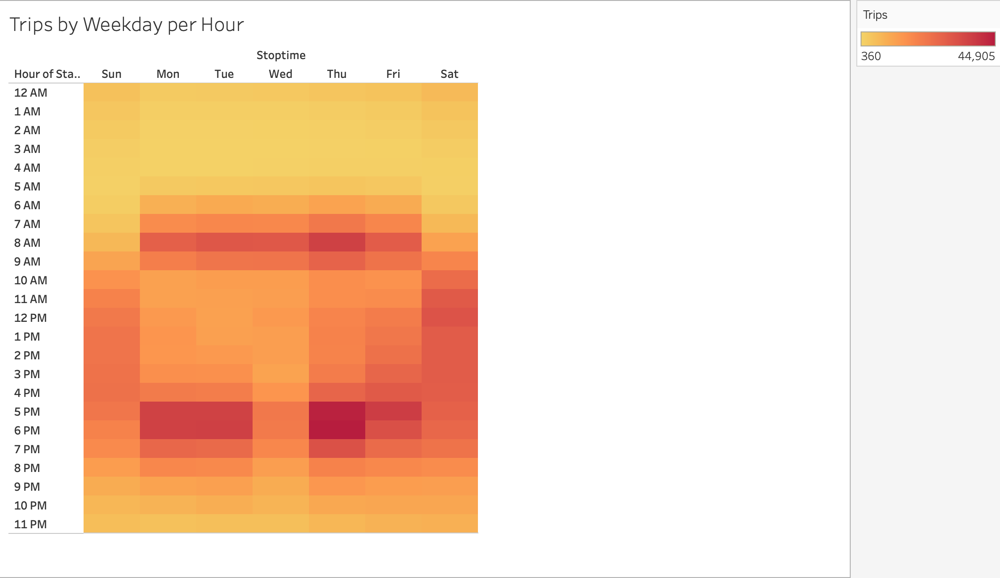
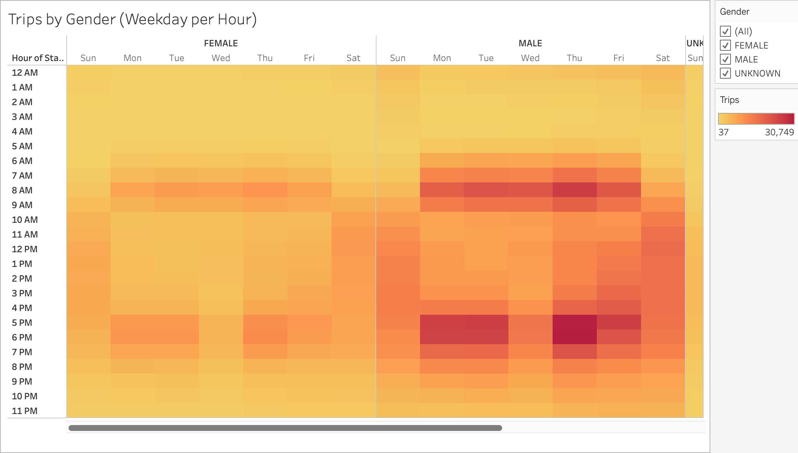

# **NYC BIKE RIDING STORY**

## ***OVERVIEW***

### The purpose of this analysis is to provide investors with enough information about the bike riding program going on in New York City so they can be convinced that it is a good business idea to have a similar schema in Des Moines.

## ***RESULTS***

### We provide the following visualizations in order to fully understand the situation in NYC:

### **1. Number of Rides**
#### The following images shows the total number of rides during August 2019 in NYC, which seems to be a very good month for the business:

### **2. User Types**
#### The mains type of user is the one that pays for a suscription as we can see below, it represents more than 80% of the total:

### **3. Gender Breakdown**
#### As we can appreciate below, the big majority of users are Male with 65%, followed by Female with 25%:

### **4. Peak Hours**
#### From the image below, we can see that most of the people uses the bike from 7 to 9 am and from 5 to 7 pm:

### **5. Top Starting Locations**
#### In the following image we can appreciate that most of people likes to start their rides around the center and the south of the city:

### **6. Checkout Time for User**
#### Below image demonstrates that most of the rides are within 60 min with a big number within the range from 0 to 30 min:

### **7. Checkout Time by Gender**
#### From the following image we can conclude that Males tend to finish their ride in less time than Females. Females usually spend around 10 min more than Males:

### **8. Trips by Weekday per Hour**
#### We can see in the next image that most riders like to use the bike from 6 to 9 am and from 5 to 7 pm during the weekdays and 9 am to 7 pm during the weekends:

### **9. Trips by Gender (Weekday per Hour)**
#### In the following image we can appreciate that both Male and Female have very similar preference in days and hours for their rides, being Males more likely to start erlier and finish later in the day:

### **10. User Trips by Gender by Weekday**
#### From the following image we can conclude that most of the users that use the bike ocasionally (customers) tend to do it during the weekend, while subscribers use the service during the whole week:

## ***SUMMARY***

### Based on the presented information we can conclude that bike riding is a very interesting business to explore in Des Moines. If we follow a similar approach that the one used in New York City, we can expect a similar behaviour by having a base of suscribers that will tend to use the service on a continuous basis.

### It is recommended though, to perform two additional visualizations to appreciate more information in order to better support the decision:
### a) Trip count by Birth Day: This visualization will help us compare the use of the service based on the user age.
### b) User type by Birth Day: This visualization will help us know the age range of each type of user, this will allow us define a better marketing strategy for suscribers for instance.
